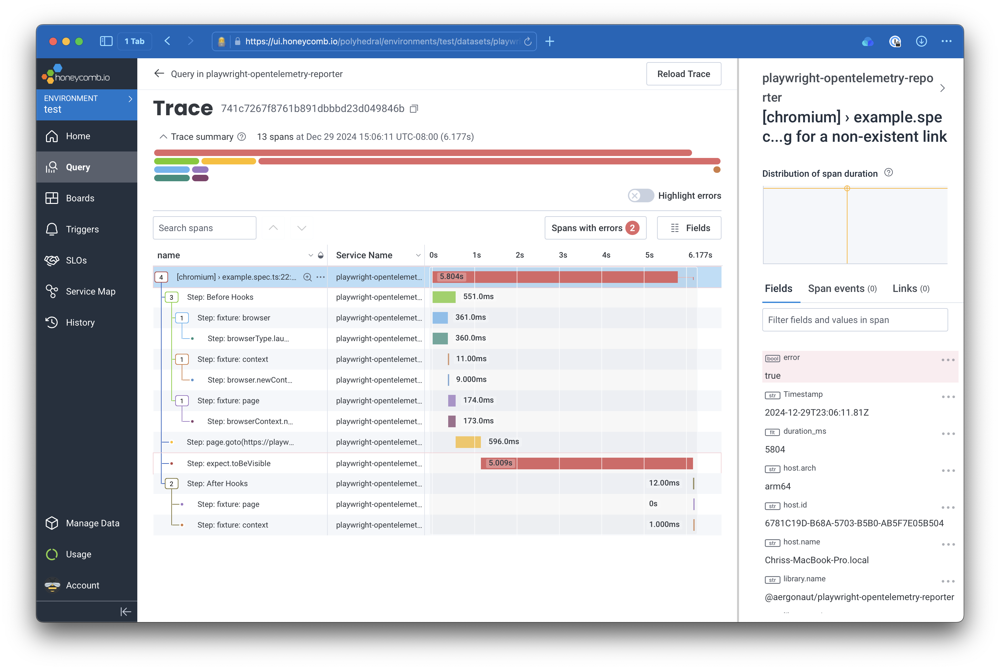

# Playwright OpenTelemetry Reporter

Simple reporter that generates OpenTelemetry traces from Playwright test runs. You can then export these traces to your
vendor of choice.



## Installation

### Dependencies

Install the package with your favorite package manager:

```
$ npm install @aergonaut/playwright-opentelemetry-reporter --save-dev
```

You will also need to install the OpenTelemetry Node SDK and any other packages required by your vendor to export traces.

```
$ npm install @opentelemetry/sdk-trace-node --save-dev
```

### Initialize the SDK

To collect traces, you must initialize the OpenTelemetry SDK before Playwright begins running your tests. The easiest
way to do this is through `globalSetup`. For example:

```ts
// global-setup.ts
const sdk = new NodeSDK({
  traceExporter: new OTLPTraceExporter(),
  metricReader: new PeriodicExportingMetricReader({
    exporter: new ConsoleMetricExporter(),
  }),
});

export default async function globalSetup(_config: FullConfig) {
  sdk.start();

  return async () => {
    await sdk.shutdown();
  };
}
```

N.b. ensure your `globalSetup` functions returns a function that calls `sdk.shutdown()`. This will ensure that traces
are exported before Playwright exits.

### Configure Playwright

Configure Playwright to use your `global-setup.ts` and the reporter:

```ts
// playwright.config.ts
export default defineConfig({
  globalSetup: require.resolve("./global-setup.ts"),
  reporter: "@aergonaut/playwright-opentelemetry-reporter",
})
```

## Usage

### Generated Spans

This reporter generates spans for each test case and for each test step within each test case. Step spans are nested
according to Playwright's internal organization. Practically, this means that work in before and after hooks will be
grouped under nested spans, as will work to set up fixtures, etc.

### Span Statuses

The reporter will set status on test spans and step spans according to the status of each test or step.

For step spans, if an error occurs during the step (e.g. a locator times out, or a click fails), the span's status will
be set to `ERROR` and the error message will be recorded on the span.

For test spans, the span will only be set to `ERROR` if the test fails _unexpectedly_. Tests which are skipped or which
pass will be `UNSET`. Similarly, expected errors (e.g. declared with `test.fail`) will also be `UNSET`.

### Attaching Span Attributes

You can attach attributes to the test span by using Playwright
[test annotations](https://playwright.dev/docs/test-annotations). Your annotation `type` must start with the prefix
`pw_otel_reporter.` in order to be attached to the span. Anything after the prefix will be used as the attribute name,
and the description will be used as the attribute value.

To make constructing the `type` easier, you can use the `annotationLabel` function.

```ts
import { annotationLabel } from "@aergonaut/playwright-opentelemetry-reporter";

test("example test", async ({ page }) => {
  // ...
  test.info().annotations.push({
    type: annotationLabel("my_annotation"),
    description: "My custom annotation!",
  });
});
```

## License

MIT.
